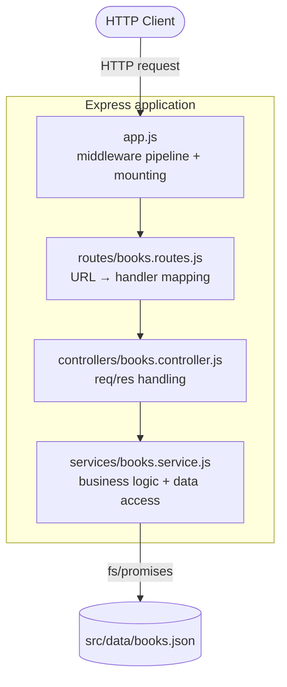
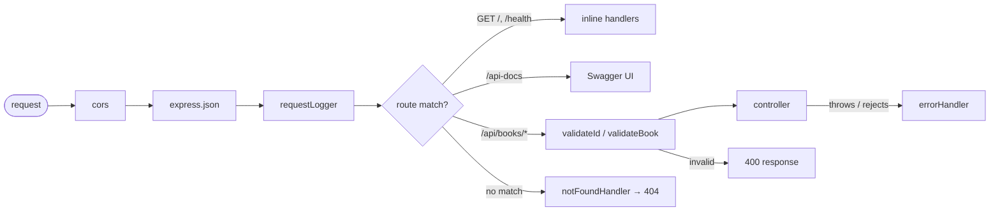
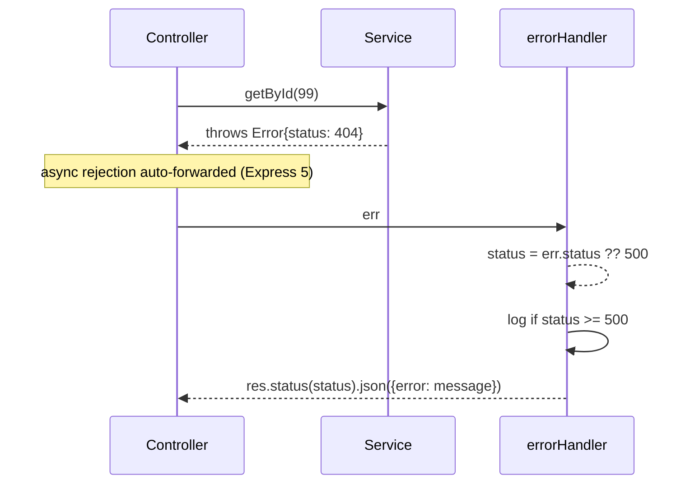
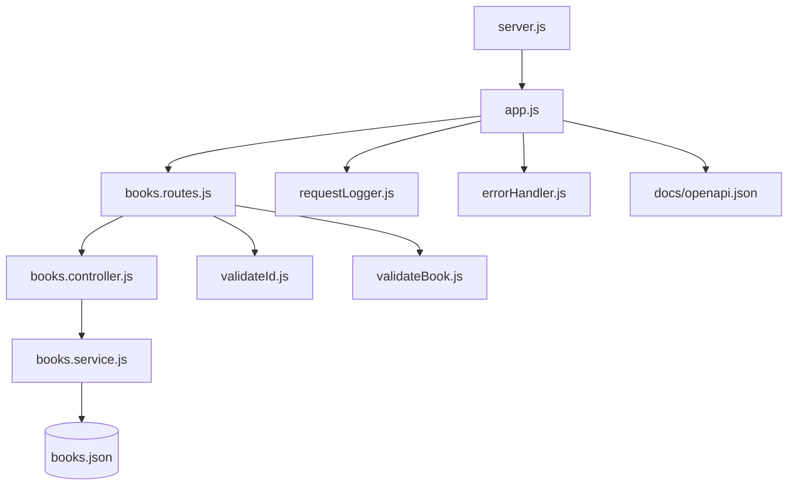
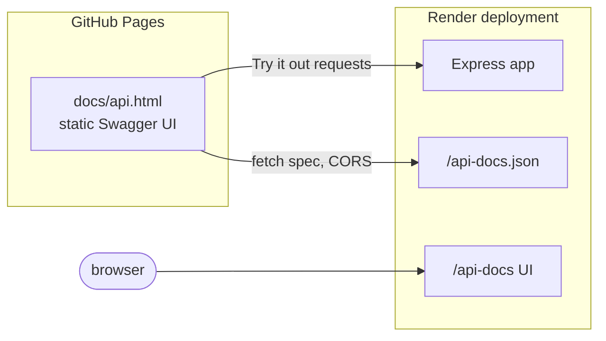

# Architecture

This document describes how the application is structured: its layers, module dependencies, and how a request travels through the system. For *why* the API behaves the way it does (status codes, data model, trade-offs), see [DESIGN.md](DESIGN.md).

## Overview

The app is a layered Express 5 application in CommonJS. Each layer has one responsibility and only talks to the layer directly below it:

- **`server.js`** — process entry point. Loads environment variables via `dotenv`, imports the app, binds the port. Nothing else.
- **`app.js`** — assembles the Express app: registers global middleware (CORS, JSON parsing, request logging), mounts the books router and the Swagger UI, and installs the terminal 404/error handlers. Exports the app *without* calling `.listen()`, so tests can import it directly (e.g. with supertest).
- **Routes** — declare which URL + HTTP method invokes which controller, and attach per-route middleware (validation). No logic.
- **Controllers** — translate HTTP to service calls: parse params/query, call the service, set the status code and JSON body. No business rules.
- **Services** — own the business logic and the data store. Throw errors with an attached `status` for the error middleware to translate. Know nothing about Express.

## Request pipeline

Middleware and routes execute in registration order. The ordering is load-bearing: routes must be registered before the 404 catch-all, and the error handler must be last.

Two validation middleware run before controllers on the routes that need them:

| Middleware | Applied to | Rejects with |
| ---------- | --------- | ------------ |
| `validateId` | `GET/PUT/DELETE /api/books/:id` | 400 if `:id` is not a positive integer |
| `validateBook` | `POST`, `PUT /api/books` | 400 with per-field detail messages |

## Error propagation

Services never touch `res`. They throw `Error` objects carrying a `status` property (e.g. 404 for an unknown id). Express 5 forwards rejected promises from async handlers to the error middleware automatically, so controllers contain no try/catch:

Anything without an explicit `status` is treated as an unexpected `500` and logged server-side; the client only ever sees JSON.

## Module dependency graph

Dependencies point strictly downward — no cycles, and no layer imports from a layer above it:

## Data layer

`books.service.js` implements a **read-through cache over a JSON file**:

1. First access reads `src/data/books.json` with `fs.promises.readFile` and caches the parsed array in module scope.
2. Reads are served from memory.
3. Every mutation (create/update/delete) rewrites the whole file with `fs.promises.writeFile`, so data survives restarts.

This is intentionally simple — a single process, small dataset, no concurrent-writer concerns. The service's public API (`getAll`, `getById`, `create`, `update`, `remove`) is fully async, so swapping the JSON file for a real database later changes only this one module.

## API documentation (Swagger)

The API documents itself. `app.js` serves two documentation endpoints, mounted with the ordinary routes (i.e. *before* the 404 catch-all):

- **`/api-docs`** — interactive Swagger UI (`swagger-ui-express`) where every endpoint can be executed with "Try it out"
- **`/api-docs.json`** — the raw OpenAPI 3.0.3 spec, for tooling

The spec itself is hand-written in `src/docs/openapi.json` and loaded with a plain `require` — it is part of the app, deployed with the app. Its `servers` URL is relative (`/`), so "Try it out" always executes against whichever origin is serving the UI: localhost in development, the Render URL in production.

There is also a **static API Explorer** for the documentation site: `docs/api.html`, published by GitHub Pages, loads Swagger UI from a CDN and fetches the spec from the *deployed* API's `/api-docs.json` (never a local copy — so the explorer cannot drift from what is actually running). Because the Pages origin differs from the API origin, the app enables open CORS; see [DESIGN.md](DESIGN.md) for why that is acceptable here. The explorer also handles Render's free-tier cold start with a retry loop before giving up.

## Configuration

Environment variables are loaded once in `server.js` via `dotenv` from a git-ignored `.env` file:

- `PORT` (default `3000`)
- `BOOKS_DATA_FILE` — optional override of the data-file path; used by the test suite to run against a throwaway copy of the seed data

## CI / repository automation / deployment

GitHub Actions workflows in `.github/workflows/`:

- **`ci.yml`** — two jobs on pushes/PRs: `npm test` (gates at 95% line/branch/function coverage) and an advisory `npm audit`
- **`gemini-review.yml`** / **`gemini-triage.yml`** — AI-assisted PR review and issue triage
- **`pages.yml`** — publishes `docs/` (including the API Explorer page) via GitHub Pages (Jekyll config in `docs/_config.yml`)

Deployment is config-as-code: **`render.yaml`** is a Render Blueprint describing the production service (free-plan Node web service, `npm ci` build, `npm start`, health checks on `/health`). The live instance runs at <https://fsep-node-express-api.onrender.com/>.
