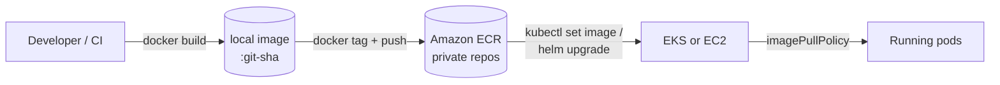

# Deployment

This document describes a production deployment plan for the books API and its
React client on AWS. For how the app is structured see
[ARCHITECTURE.md](ARCHITECTURE.md); for the local container setup see
`docker-compose.yml` and `nginx-deployment.yml` in the repo root.

The system has three deployable parts:

| Component | Image | Port | State |
| --------- | ----- | ---- | ----- |
| API | `fsep-node-express-api-api` (root `Dockerfile`) | 3000 | stateless |
| Client | `fsep-node-express-api-web` (`client/Dockerfile`, nginx) | 80 | stateless |
| Database | MongoDB | 27017 | **stateful** |

## Image build and push workflow

Local build → Amazon ECR → cluster. The same two images serve every
environment; only configuration changes between them.



### Steps

1. **Build** with an immutable tag — the Git commit SHA, never `latest`:

   ```bash
   TAG=$(git rev-parse --short HEAD)
   docker build -t fsep-node-express-api-api:$TAG .
   docker build -t fsep-node-express-api-web:$TAG ./client
   ```

2. **Authenticate** to ECR (token is valid 12 h):

   ```bash
   aws ecr get-login-password --region $AWS_REGION \
     | docker login --username AWS --password-stdin \
       $ACCOUNT.dkr.ecr.$AWS_REGION.amazonaws.com
   ```

3. **Tag and push** to one private repo per image:

   ```bash
   REG=$ACCOUNT.dkr.ecr.$AWS_REGION.amazonaws.com
   for img in api web; do
     docker tag fsep-node-express-api-$img:$TAG $REG/fsep-node-express-api-$img:$TAG
     docker push $REG/fsep-node-express-api-$img:$TAG
   done
   ```

4. **Deploy** by pinning the new tag:

   ```bash
   kubectl set image deployment/nginx-api-deploy nginx-api=$REG/fsep-node-express-api-api:$TAG
   kubectl rollout status deployment/nginx-api-deploy
   ```

   (or `helm upgrade --set image.tag=$TAG`, or push the manifest change through
   GitOps / Argo CD).

### Supporting setup

- **CI does the build and push**, not laptops — a GitHub Actions job assuming an
  IAM role via OIDC (no long-lived AWS keys), on merge to `main`.
- **ECR lifecycle policy**: keep the last ~20 images per repo, expire untagged
  after 1 day. Stops the registry growing without bound.
- **Scan on push** enabled so known-CVE images are visible before rollout.
- **`imagePullPolicy: IfNotPresent`** with SHA tags — a given tag is
  immutable, so there is nothing to re-pull and rollbacks are just
  `kubectl rollout undo` or re-pinning the previous SHA.

## Deployment target: EC2 + Docker Compose vs. EKS

### Option A — single EC2 instance running Docker Compose

Lift the existing `docker-compose.yml` onto one EC2 host (behind an ALB or just
an Elastic IP), pull images from ECR, `docker compose up -d`.

#### Pros

- Almost nothing new to learn — the compose file already works.
- Cheapest possible footprint: one instance, one EBS volume, no control-plane
  charge.
- MongoDB can run as a compose service with its data on an EBS volume — no
  managed-database bill.

#### Cons

- **Single point of failure.** Instance or AZ loss = full outage. No rolling
  deploy — `compose up` briefly drops connections.
- Scaling is manual and vertical only (resize the instance); no horizontal
  scaling without building your own load balancing across hosts.
- You own OS patching, Docker upgrades, log shipping, backups, and MongoDB
  operations by hand.
- Secrets tend to end up in a `.env` file on the box.

Good for: a demo, an internal tool, or a cost-capped staging environment.

### Option B — Amazon EKS

Run the API and client as Kubernetes `Deployment`s (the `nginx-deployment.yml`
manifests already exist), MongoDB on **Amazon DocumentDB** or **MongoDB Atlas**
rather than in-cluster, ALB Ingress Controller for north-south traffic.

#### Pros

- Multi-AZ by default; self-healing pods; rolling updates with health-gated
  cutover and instant `rollout undo`.
- Horizontal scaling is a first-class primitive — HPA on the API, Cluster
  Autoscaler / Karpenter on nodes.
- Native fit for secrets (External Secrets + Secrets Manager), RBAC, network
  policy, observability add-ons.
- The same manifests describe every environment.

#### Cons

- **~$73/month for the control plane** before a single workload runs, plus
  nodes, plus (if used) NAT gateway and ALB hours.
- Real operational surface: cluster upgrades, add-on version skew, IAM-for-
  service-accounts, YAML sprawl.
- Overkill for one small stateless API with low traffic.

Good for: anything with an availability SLA, multiple services, or a team that
already runs Kubernetes.

### Recommendation

**Start on EC2 + Compose** for this project's current scale (one API, modest
traffic, a demo database). The moment any of these become true, move to **EKS**
(or ECS/Fargate as a lighter middle ground):

- an uptime commitment that a single instance can't meet,
- more than ~2–3 services or teams touching deploys,
- traffic that needs autoscaling rather than a predictable fixed size.

Keep MongoDB **out of the application host/cluster** in either case for
production — Atlas or DocumentDB — so backups, failover, and patching are not
your problem.

## Secrets in production

Nothing sensitive is committed. The repo only carries non-secret defaults
(`docker-compose.yml` env, `render.yaml` with `MONGODB_URI` marked
`sync: false`), and `.env` / `.env.*` are git-ignored.

**Source of truth: AWS Secrets Manager** (or SSM Parameter Store SecureString
for lower cost). Secrets held there: `MONGODB_URI` (with credentials), any API
keys, TLS material if terminated at the app.

Delivery by target:

- **EKS** — the [External Secrets Operator](https://external-secrets.io/) syncs
  a Secrets Manager entry into a native Kubernetes `Secret`; pods consume it via
  `envFrom.secretRef` or a mounted file. IAM Roles for Service Accounts (IRSA)
  scopes each workload to only the secrets it needs. No secret value is ever in
  a manifest or in Git.
- **EC2 + Compose** — the instance profile grants `secretsmanager:GetSecretValue`
  for a specific ARN prefix; an entrypoint script (or `aws-vault` /
  `chamber exec`) fetches values at container start and injects them as env
  vars. The `.env` file, if used at all, is rendered on the box at deploy time
  and never leaves it.
- **CI** — no static AWS keys; GitHub Actions assumes a deploy role through
  OIDC. Any secret CI genuinely needs lives in GitHub Actions encrypted
  secrets.

Supporting practices: rotate `MONGODB_URI` credentials on a schedule (Secrets
Manager rotation Lambda), enable CloudTrail data events on secret reads, scope
IAM policies to exact secret ARNs, and keep a `.gitignore` + a pre-commit
secret scanner (`gitleaks`) as a backstop.

## Scaling strategy

The API is **stateless** (session-free, all state in MongoDB), so it scales
horizontally cleanly. The database does not.

### Scale horizontally (more replicas) when

- **CPU or event-loop latency rises under concurrent load** while per-request
  work stays cheap — Node is single-threaded per process, so more replicas =
  more cores in use. This is the common case for an I/O-bound REST API.
- **You need headroom for instance/AZ failure** — 2 replicas minimum (the
  manifest already sets this) so losing one pod is not an outage.
- **Traffic is spiky** — an HPA on the API Deployment (target ~60–70% CPU, or a
  custom p95-latency metric) adds and removes pods automatically; pair with
  Cluster Autoscaler / Karpenter so nodes follow.
- Rule of thumb here: add replicas first, always, until you hit a per-pod
  resource ceiling or a downstream limit (MongoDB connections).

### Scale vertically (larger instances / bigger limits) when

- **A single request needs more memory or CPU than the current limit** — large
  response assembly, heavy JSON, an in-process cache. More replicas don't help
  if one request OOMs.
- **MongoDB is the bottleneck** — it scales *up* (bigger instance, more IOPS,
  more RAM for the working set) far more readily than out. Replica sets add read
  capacity and HA, not write throughput; sharding is a big step. Right-size the
  DB instance before anything else.
- **Connection or file-descriptor pressure** — every API replica holds a
  MongoDB connection pool; past a point, fewer larger pods are kinder to the
  database than many small ones.
- **Bin-packing efficiency** — if pods are tiny, a slightly larger node type can
  be cheaper per unit of compute.

### Practical limits to set

- API: `requests` = steady-state usage, `limits` ≈ 2× requests (already
  100m/500m CPU, 128Mi/256Mi in the manifest); revisit with `kubectl top`.
- Cap `maxReplicas` on the HPA so a traffic surge (or a bug) can't exhaust the
  MongoDB connection limit or the AWS budget.
- Client (nginx static) barely needs anything — 2 replicas for HA, tiny
  requests, no HPA.

## Cost considerations

### AWS resources in play

| Resource | Purpose | Rough cost driver |
| -------- | ------- | ----------------- |
| ECR | private image repos | GB-months stored + data transfer |
| EC2 **or** EKS | compute | instance hours; EKS adds ~$0.10/h control plane |
| EBS | node/instance root + MongoDB data (self-hosted) | provisioned GB + IOPS |
| ALB | HTTPS ingress | hours + LCUs |
| NAT Gateway | private-subnet egress (pulls, Secrets Manager) | hours + per-GB processed |
| Secrets Manager | secret storage | per secret per month + API calls |
| DocumentDB / Atlas | managed MongoDB (recommended for prod) | instance hours + storage + I/O |
| CloudWatch | logs & metrics | ingested + stored GB, custom metrics |
| Data transfer | cross-AZ, egress to internet | per GB |

### How to minimise it

- **Right-size and use Graviton (`arm64`)** node/instance types — ~20% cheaper
  for the same performance; the Node and nginx images build multi-arch fine.
- **Commit to a plan for the steady-state floor** — Compute Savings Plans or
  Reserved Instances for the always-on baseline; leave burst capacity
  on-demand or Spot.
- **Spot for stateless pods** — the API and client tolerate interruption; run
  them on a Spot node group with an on-demand fallback. Never Spot for MongoDB.
- **Kill the NAT Gateway if you can** — it is often the biggest surprise line.
  Use VPC endpoints (Gateway endpoint for S3/ECR-layers is free; Interface
  endpoints for ECR API, Secrets Manager, CloudWatch) so image pulls and secret
  fetches don't traverse NAT.
- **One ALB, many services** — share it via Ingress rules / host routing rather
  than an ALB per service.
- **ECR lifecycle policies** (above) so storage doesn't creep.
- **CloudWatch log retention** set to 14–30 days, not "never"; sample or drop
  debug logs in prod.
- **Scale to the floor off-peak** — lower HPA `minReplicas` and let the Cluster
  Autoscaler shrink node count on nights/weekends for non-prod.
- **Prefer managed MongoDB's smallest viable tier** and scale it deliberately;
  an oversized DB instance is the easiest money to waste here.
- **For this project specifically:** the EC2 + Compose target on a single
  small Graviton instance with an Elastic IP (no ALB, no NAT, no control-plane
  fee) is by far the cheapest path and is appropriate until an SLA forces the
  move to EKS.
