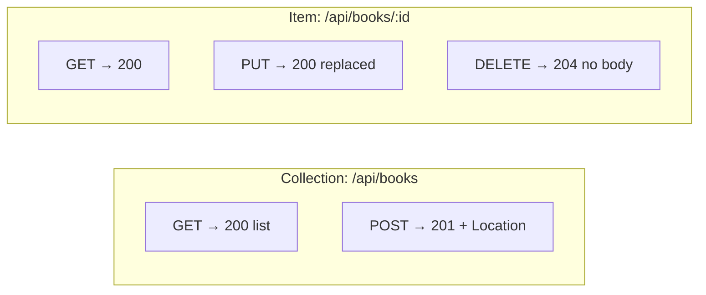
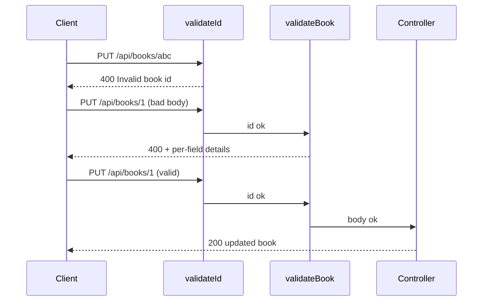

# Design

This document explains the design decisions behind the API — the resource model, REST conventions, validation strategy, and the trade-offs taken. For the structural view (layers, modules, request pipeline), see [ARCHITECTURE.md](ARCHITECTURE.md).

## Resource model

The API manages one resource: **books**, restricted to two genres.

| Field | Type | Rules |
| ------- | ------ | ------- |
| `id` | integer | Server-assigned, sequential (`max(id) + 1`), immutable |
| `title` | string | Required, non-empty |
| `author` | string | Required, non-empty |
| `genre` | string | Required, one of `science-fiction`, `fantasy` |
| `year` | integer | Required, `0 ≤ year ≤ current year + 1` |

Ids are assigned server-side and never accepted from the client — a `POST` body containing an `id` is ignored. `update` copies only the four writable fields, so the id cannot be changed through `PUT` either.

## Endpoint design

URLs follow REST resource conventions: a plural-noun collection (`/api/books`) and item addressing by id (`/api/books/:id`). The `/api` prefix separates the resource API from infrastructure endpoints (`/`, `/health`, `/api-docs`).



### Status code contract

| Code | When |
| ------ | ------ |
| 200 | Successful GET or PUT |
| 201 | POST created a book; response includes a `Location: /api/books/:id` header |
| 204 | DELETE succeeded; no response body |
| 400 | Malformed id (`/api/books/abc`) or invalid body (missing/invalid fields) |
| 404 | Well-formed id that matches no book; any unmatched route |
| 500 | Unexpected error (no explicit status attached) |

A deliberate distinction: **malformed input is 400, missing resources are 404**. `/api/books/abc` is a client error (the id can never be valid), while `/api/books/99` is a well-formed request for something that doesn't exist.

### PUT semantics

`PUT` is a **full replacement**: the body must pass the same complete validation as `POST` (all four fields required). Partial updates would be `PATCH`, which is intentionally not implemented — one clearly-specified update verb keeps the validation story simple.

### Query parameters

`GET /api/books` supports two composable filters:

- `?genre=` — exact match against the two allowed genres
- `?author=` — **case-insensitive substring** match (`?author=le guin` matches "Ursula K. Le Guin"), because searching for people by exact full name is hostile to clients

Unknown query parameters are ignored rather than rejected — filters narrow the collection, and an unrecognized filter narrowing nothing is harmless.

## Validation strategy

Validation happens **in middleware, before controllers run**, so handlers only ever see well-formed input:



Validation errors return **all** failing fields at once (`details: [...]`), not just the first — a client fixing a form shouldn't need N round-trips to discover N problems.

## Error model

Every error response has the same JSON shape:

```json
{ "error": "<message>", "details": ["..."] }
```

(`details` appears only on validation failures.) Services signal errors by throwing an `Error` with a `status` property; a single centralized error handler translates them into responses and defaults anything unmarked to 500. Server-side stack traces are logged only for 5xx — 4xx are expected client behavior, not incidents. Internals (stack traces, file paths) are never leaked into responses.

## API documentation: hand-written OpenAPI, served by the app

The API ships an interactive Swagger page at `/api-docs` ("Try it out" executes real requests) backed by a spec at `/api-docs.json`. Three deliberate choices:

**Hand-written spec over annotation-generated.** The OpenAPI 3.0.3 document lives in one reviewable file (`src/docs/openapi.json`) rather than being assembled from JSDoc comments scattered across route files. At seven routes, one explicit file is easier to audit against DESIGN.md's contract than generation config — and the spec can state things the code doesn't express directly (examples, the `Location` header, field-level descriptions). The accepted cost is drift risk: a route change requires a matching spec edit. Tests that assert on the spec's paths give partial protection.

**The app serves its own spec.** `/api-docs.json` comes from the running server, so whatever is deployed *is* the documentation source. The static API Explorer on the docs site (`docs/api.html`, GitHub Pages) fetches the spec from the deployed API rather than bundling a copy — the explorer can be stale in appearance (CDN-loaded Swagger UI) but never in content.

**Relative `servers` URL.** The spec declares `servers: [{"url": "/"}]`, so the in-app UI targets whichever origin serves it — no environment-specific spec builds. The Pages explorer, which runs on a different origin, overrides the server URL at load time to point at the Render deployment.

**CORS is deliberately open** (`Access-Control-Allow-Origin: *`): the Pages explorer calls the API cross-origin, and this is a public demo API with no credentials or per-user data. CORS restrictions protect users of credentialed APIs, not servers — anything a browser is blocked from, `curl` can do anyway — so restricting origins here would add configuration without adding safety.

## Persistence: JSON file over a database

The assessment allows an in-memory array or JSON file. The JSON file was chosen because it:

- demonstrates `fs/promises` + `path` (a Node fundamentals requirement) in real use
- survives restarts, making manual testing less confusing
- keeps the service API async, so the module is signature-compatible with a future database-backed implementation

Accepted trade-offs at this scale: whole-file rewrites on every mutation, no atomicity across concurrent writers, and a single-process assumption. All are acceptable for an assessment-sized dataset and would be solved by swapping the service internals for a real store.

## Design constraints from the assessment

- **CommonJS** module system (`require`/`module.exports`) — the project was originally scaffolded as ESM and converted
- No database; no authentication; single resource
- At least one custom middleware (this app has four: logging, id validation, body validation, error handling)
